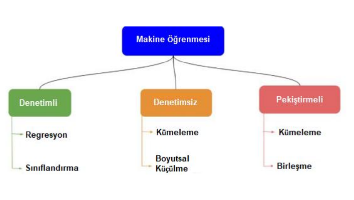

# Refleks-Tespiti
Bu çalışmada, derin öğrenmeden yararlanılarak üretilen ve veri setlerinden hazır
alınan görüntüler kullanılarak, bir arayüz aracılığıyla kullanıcıların görsel algılama
ve reflex sürelerinin ölçülmesi ve bu verilerin kaydedilerek, istatistiksel olarak
hesaplanması ve arayüzün rapor sayfasında kullanıcıya gösterilmesi amaçlanır.
Derin öğrenme modeli GAN kullanılarak sentetik görüntüler üretilir ve üretilen
görüntüler bir konvolüsyonel sinir ağı modeli ile tahmin edilerek yalnızca yüksek
tahmin oranına sahip görüntülerin, bir arayüz üzerinde kullanıcının görüntü algılama
ve refleks ölçümlerinin gerçekleştirilmesinde kullanılmak üzere kaydedilmesi
sağlanır. Bu modellerin eğitilmesinde MNIST el yazısı rakam veri setinden
yararlanılır ve rakam görselleri üretilir. Ayrıca sentetik oluşturulan görüntülerin
dışında, Caltech-UCSD Birds-200-2011 veri setindeki gerçek kuş resimleri ve
Oxford Flowers 102 veri setindeki gerçek çiçek resimleri de kullanıcının görsel
algılama ve refleks süresinin ölçülmesi için arayüzde kullanılmıştır. Bu görüntüler,
arayüz içerisinde kullanıcıya sunulan üç farklı eşleştirme oyunundaki butonlara ikon
olarak eklenerek üzerlerine tıklanabilir yani kullanıcı tarafından seçilebilir hale
getirilir. Rakam görüntülerini içeren eşleştirme oyununda, 9 butondan rastgele 7
tanesi farklı rakamlara ait, rastgele 2 tanesi rastgele olarak seçilmiş aynı rakama ait
olacak şekilde görseller rastgele butonlara eklenir. Kullanıcının aynı rakama ait iki
butonu üzerlerine tıklayarak seçmesi gerekmektedir. Kuş görüntülerini içeren
eşleştirme oyununda, 200 kuş türü arasından rastgele seçilmiş 8 farklı kuş türüne ait
görsel ve bu görseller arasından rastgele olarak seçilmiş ve o resmin renksiz (gri
tonlu) hali olan bir resim butonlara eklenir ve kullanıcıdan renksiz resim ve bu
resmin renkli halinin seçilmesi istenir. Refleks süresi, tıklanan birinci buton ile ikinci
buton arasında geçen süre olarak alınmaktadır. Çiçek görüntülerini içeren eşleştirme
oyununda, 92 çiçek türü arasından rastgele seçilmiş bir çiçek türüne ait rastgele 8
görsel ve rastgele seçilmiş, bundan farklı bir çiçek türüne ait rastgele bir görsel
butonlara eklenir. Kullanıcıdan, farklı çiçek türüne ait görselin seçilmesi istenir.
Refleks süresi, turun başlangıcı ile bir butona tıklanması arasında geçen süre olarak
alınmaktadır. Oyun, bu şekilde 10 tur boyunca oynanır ve her turda yeni görseller
butonlara eklenir. Son olarak elde edilen verilerden minimum ve maksimum tıklama
süreleri, ortalama tepki süresi, doğru cevaplar için ortalama tepki süresi ve standart
sapma gibi bilgiler hesaplanarak arayüzün rapor sayfasında kullanıcıya gösterilir.
Sonuç olarak, program başarılı bir şekilde çalışmış ve istenen bilgiler kullanıcılardan
elde edilmiştir. GAN modelin bazen bozuk görseller üretmesi ve konvolüsyonel sinir
ağı modelinin bozuk görselleri yüksek doğrulukta tahmin etmesi sebebiyle, bazı
rakam görüntülerinin hangi rakama ait olduğu, kullanıcı tarafından zor anlaşılabilir.

# Projenin Amacı
Projenin asıl amacı refleks tespiti olmakla beraber, projede derin öğrenme
kullanılarak sentetik görüntü üretilmesi ve bu üretilen görüntülerin kullanılması
beklenmektedir. Hazırlanan program, kullanıcının refleksini tespit edebilmek için bir
algoritma kullanır. Bu algoritma kullanıcı etkileşimli olup, kullanıcıdan alınacak
bilgi ise 9 resim arasından seçilen iki resim için fare tıklamaları arasında geçen süre
olacaktır. Bu işlem 10 defa tekrarlanarak kullanıcıya özgü refleks ortalaması
belirlenir. Bu işlem için bir arayüz tasarımı gereklidir. Arayüzde seçimler sarı
işaretleme ile gösterilirken doğru seçimler yeşil, yanlış seçimler ise kırmızı
işaretlemeler ile belirlenmektedir.Seçimlerde nesneler MNIST veri setinden sınıflandırılmış
olarak alınmayacak, bunun yerine bu veri seti kullanılarak sentetik veriler üretilecek
ve üretilen bu sentetik veriler kullanılacaktır.

# Çalışma Prensibi
Sistemin çalışma prensibinin ilk aşaması hazır veri setimizden resim üretecek derin
öğrenme algoritmasının eğitilmesidir. Eğitimler sonrası elde edilen algoritma
cgan_generator.h5 olarak arayüzün de bulunacağı klasöre eklenmiştir. Bu dosyamız
bize anlık olarak sentetik veriler üretecektir. Sentetik veri üretebilindiğine göre bu
kısımdan sonrası üretilen sentetik veri ile kullanıcı etkileşimli bir refleks tespiti
algoritması hazırlamaktır ve bu süreç arayüz tasarımı ile beraber geliştirilmiştir.

# DERİN ÖĞRENME
Derin öğrenme, yapay zeka teknolojisinde karar verme mekanizmasının insan
beyninin çalışma prensibine göre düzenlenip, oluşturulan yapay sinir ağları ile daha
karmaşık kararlar vermesine olanak sağlayan bir teknolojidir. Yapay zeka kavramı
ilk olarak 1956 yılında John McCarhy tarafından bir akademik makalede ortaya
atıldı. Bu tarihten sonra yapay zeka üzerinde akademik çalışmalar başladı ve 1959
yılında bir alt dalı olarak “Makine Öğrenimi” terimi ortaya atıldı.
Makine öğreniminde de asıl amaç bilgisayarın sayısal öğrenme ve model tanıma
çalışmaları yapmasıdır. 1959 yılında Arthur Samuel “makinelerin bilhassa
programlanmadığı sonuçları öğrenebilme kabiliyeti” olarak tanımlamıştır. Makine
öğreniminde makinelerin öğrenim yapabilmesi için belirli yöntemler vardır.

# Yapay Sinir Ağları
Yapay sinir ağları derin öğrenmenin temel anahtarıdır. Yapay sinir ağları kurulurken
insan nöral sistemi baz alınır ve işlemler insan beyninde nasıl yapılıyorsa aynı
işlemler yapay sinir ağlarında da yapılır. Yapay sinir ağlarına konvolüsyonel sinir ağı
örnek verilebilir. Konvolüsyonel sinir ağı (CNN), ileri beslemeli derin yapay sinir
ağıdır. Yapay sinir ağları katmanlardan oluşur, bu katmanlar sırasıyla giriş katmanı,
gizli katman ve çıkış katmanıdır.

